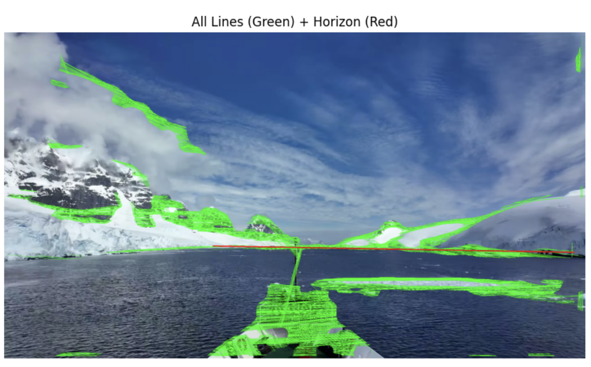
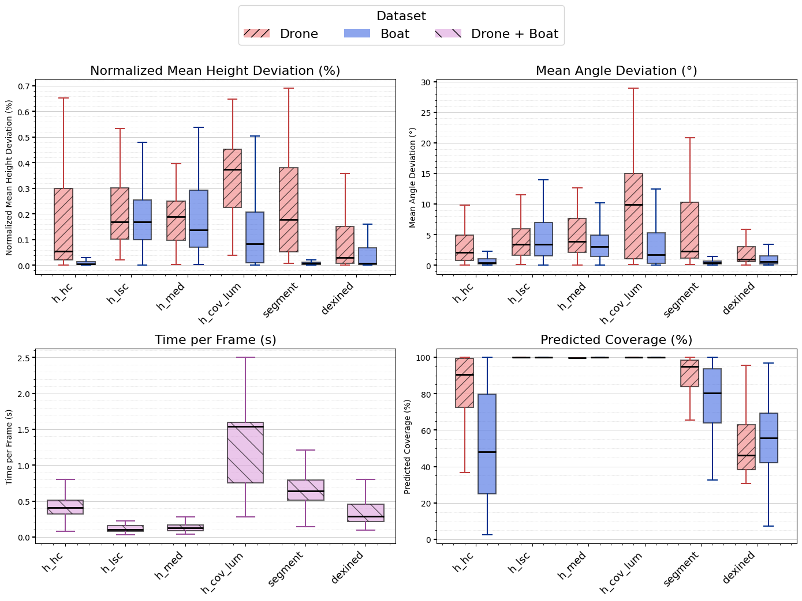
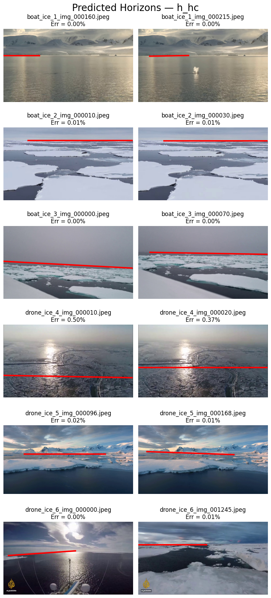

# Horizon Detection Pipeline
Made by: Alisa Pesotskaia 

This repository implements **six horizon detection algorithms**, including:

- H-HC  
- H-LSC  
- H-MED  
- H-COV-LUM  
- Segment  
- DexiNed  

It includes:

1. **Dataset creation** – extracting frames from videos and organizing annotations.  
2. **Algorithm implementation** – running each horizon detection method.  
3. **Testing and result analysis** – computing accuracy metrics, visualizing results, and performing statistical comparisons.


## Project Aims

This project aims to answer the following research questions:

- **Which horizon detection method provides the best trade-off between computational efficiency and detection accuracy** when using ship-based and drone-based images in ice-covered waters?  
- **How does the performance of classical and hybrid deep learning-classical horizon detection methods vary** when applied to ship-based versus drone-based images in ice-covered waters?

## Setup of the environment
Not needed as all the ipynb files can be run in Google Colab directly

## Data Preparation

To create the dataset, videos containing ice-covered waters were collected.  
All videos were sourced from YouTube under Creative Commons (CC) licenses.

### Source Videos

- **Bo Ventures** — *Antarctica Expedition: 10 Days at Sea (4K)*  
  Online video, Dec 27, 2024  
  https://www.youtube.com/watch?v=X13885ZPQTI

- **P. Auteri** — *Arctic Sea Ice with Seal in Svalbard*  
  Online video, Feb 20, 2020  
  https://www.youtube.com/watch?v=uHwOrPwagnY

- **Wandering_Spiritlust** — *Antarctica Expedition – Cruising Through Sea Ice*  
  Online video, Feb 13, 2023  
  https://www.youtube.com/watch?v=B8cK8VgIE1A

- **FLUENT** — *Island Besieged by Sea Ice in Northeast China (Liaodong Bay)*  
  Online video, Jan 29, 2018  
  https://www.youtube.com/watch?v=WCY2JzIx1aA

- **Free Copyright Videos** — *Fly Above Frozen Panorama of an Antarctica Snow-Covered Mountain Range (4K)*  
  Online video, Jul 3, 2024  
  https://www.youtube.com/watch?v=BnBKGiYTRkc

- **Civil Disturbia** — *The Weddell Sea: Secret Antarctic Sea*  
  Online video, Mar 11, 2018  
  https://www.youtube.com/watch?v=R0NzNhXt_38

### Annotation tool
The annotation was performed using the **CVAT annotation tool**:

B. Sekachev, N. Manovich, M. Zhiltsov, A. Zhavoronkov, D. Kalinin, B. Hoff, T. Osmanov, D. Kruchinin, A. Zankevich, D. Sidnev, M. Markelov, J. Johannes, M. Chenuet, A. Andre, T. Telenachos, A. Melnikov, J. Kim, L. Ilouz, N. Glazov, P. Priya, R. Tehrani, S. Jeong, V. Skubriev, S. Yonekura, V. Truong, Z. Liang, L. Zhiming, and T. Truong,  
**opencv/cvat: v1.1.0**, Zenodo, Aug. 2020.  
Available: [https://doi.org/10.5281/zenodo.4009388](https://doi.org/10.5281/zenodo.4009388)

## Annotating Videos in CVAT

To annotate your videos, follow these steps:

1. Go to [CVAT](https://www.cvat.ai/), then **register** or **log in**.
2. Navigate to **Tasks → Create a New Task**.
3. Fill in the task details:
   - **Name:** Give your task a descriptive name.
   - **Labels:** Set up a "Horizon" polyline. You can copy and paste the following JSON in the **Raw** field:

   ```json
   [
     {
       "name": "Horizon",
       "color": "#fa32b7",
       "type": "polyline",
       "attributes": []
     }
   ]
4.	Load your video for annotation.
5.	Open **Advanced Configuration** and set the **Frame Step** to at least 10 to avoid annotating too many similar frames.
6.	Click **Submit & Open**.
7. Open the task and the job.  
   - There should be only one job, but you can create multiple jobs and assign them to different people if needed.
8. To mark the horizon:  
   - Select **"Draw new polyline"** from the left sidebar.  
   - Choose the **Horizon** label.  
   - At the bottom, select either **Shape** or **Track**:  
     - **Shape** allows you to draw a single polyline on the current frame.  
     - **Track** propagates the polyline across future frames, making annotation faster and easier.
9. When you finish the annotation, export the dataset:  
   - Go to **Tasks** and select your task.  
   - Click **Actions → Export Task Dataset**.  
   - Choose the format **CVAT for images 1.1**.  
   - **Do not save the images**—only export the annotation XML file.A short video is shown below to show the process. 

### CVAT Annotation Demo

Here is a short demonstration of the horizon annotation workflow in CVAT:


### Pre-Created Dataset

The already created dataset is available [here](https://drive.google.com/drive/folders/1YnniIKyFp4mn8gNUHPyTSYn8bDMEydlY?usp=sharing).

## Creating the Dataset

To extract annotated frames from a video:

1. Upload the video and its corresponding XML annotation file to **Google Drive**.  
2. Open and run the notebook [**DatasetFromCVAT.ipynb**](./DatasetFromCVAT.ipynb) in Google Colab.  
   - This notebook parses the video and extracts frames.  
   - It also saves a CSV file containing the polyline coordinates for all selected frames.
## Running the Horizon Detection Algorithms

The implementation is available in the notebook [**Algorithms.ipynb**](./Algorithms.ipynb).

### Brief Outline

This document implements a pipeline for running multiple horizon detection methods on images, including:

- **H-HC**
- **H-LSC**
- **H-MED**
- **H-COV-LUM**
- **Segment**
- **DexiNed**

The code is organized into three main parts:

1. **Implementation of the algorithms** – defining all horizon detection methods.  
2. **Running the algorithms on a single image** – visualize results and adjust parameters.  
3. **Running the algorithms on all images** – process the full dataset and save predicted horizon coordinates to a CSV file.

After completing the third part, the results will be saved to **Google Drive** in CSV format.

### Example of Detected Horizon

The figure below shows an example of a detected horizon using the DexiNed algorithm.



## Analyzing the Horizon Detection Results

The implementation and full analysis are available in the notebook [**StatisticalAnalysis.ipynb**](./StatisticalAnalysis.ipynb).  
It includes:

- Accuracy metric calculations  
- Boxplots of results  
- Mann-Whitney U tests with Holm-Bonferroni correction  
- Visualization of predicted and ground truth horizons

### Box Plot for All Methods

The figure below shows the distribution of accuracy metrics across all methods.  



### Predicted Horizon Example – H-HC

The figure below shows the predicted horizon by the **H-HC** method for 2 frames from each video:



## Key Findings

**Research Question 1:**  
The best trade-off between computational efficiency and detection accuracy is:

- **Drone-based images:** DexiNed  
- **Boat-based images:** Segment  

H-HC remains competitive, and in scenarios with limited computational resources, H-HC is the preferred alternative to hybrid deep learning-classical methods.  

**Research Question 2:**  
Performance metrics indicate that detecting the horizon is **more challenging in drone-based images** than in boat-based images. Specifically, **Normalized Mean Height Deviation (NMHD)** and **Mean Angle Deviation (MAD)** are substantially better for **boat-based images**, showing  that method performance varies with the image source.